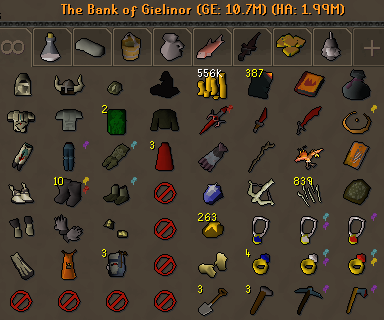
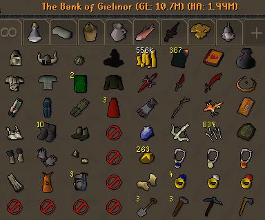

# Emote Clue Items
Emote Clue Items is a simple RuneLite plugin which highlights items that are required for emote clue steps. 

Maintaining free bank space can be quite cumbersome, especially when you are not sure which items should be kept for future clue scrolls. With this plugin, throwing away items may be a bit less stressful, as this plugin aims to highlight all emote clue items.

## Example
Example of a bank tab with the plugin turned on.

Example of a bank tab with the plugin turned off.

