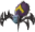
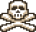
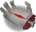
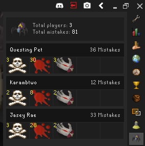
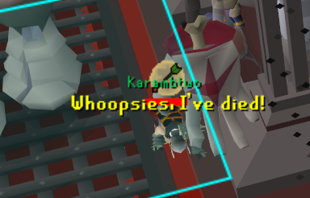
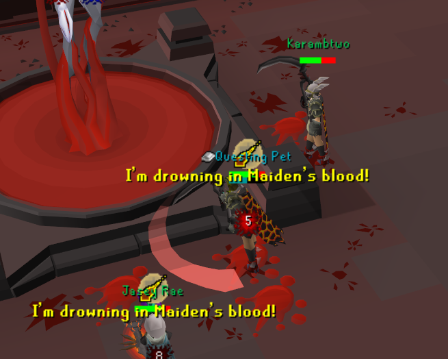

# Tob Mistake Tracker

Tracks mistakes made by players throughout the Theatre of Blood.

---
Enabling this plugin will track mistakes for you and all of your teammates in a raid. It will also track
mistakes while for other raiders while you're spectating.

Current mistakes being tracked:

*  **Deaths** throughout the raid
*  Standing in **Maiden** Blood
*  Getting hit by **Bloat** Hands

Coming Soon:

* Taking damage from a **Soteseg** orb with no vengeance
* Getting bounced during **Verzik P2**
* Getting bombed during **Verzik P2**
* Stepping on acid during **Verzik P2**

* Meleeing the team as the tank during **Verzik P3**
* Taking a purple tornado during **Verziks P3**

---

## Screenshots

