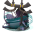
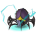

# Tob Mistake Tracker

Tracks mistakes made by players throughout the Theatre of Blood.

---
This plugin will track mistakes for you and your teammates in the Theatre of Blood. It will also track mistakes for
other raiders while you're spectating.

By default, when detecting a mistake, all players with this plugin will receive a public message of the mistake, a
chat overhead above the player who made the mistake, and the mistake will be added to the Tob Mistake Tracker
side-panel.

Current mistakes being tracked:

*  **Deaths** throughout the raid (including specific death counts per room)
*  Standing in **Maiden** Blood
*  Getting hit by **Bloat** Hands
*  Getting bounced during **Verzik P2**
*  Getting bombed during **Verzik P2**
*  Stepping on acid during **Verzik P2**
*  Getting webbed during **Verzik P3**
*  Taking a purple tornado during **Verzik P3**

Coming Soon:

*  Taking damage from a **Soteseg** orb with no vengeance
*  Meleeing the team as the tank during **Verzik P3**
* Other feature requests

---

## Screenshots

---

## Changes

#### 2.1
* Add config for toggling mistake overhead text

#### 2.0
* Track raid counts for each player
* Track deaths per boss rom
* Add death grouping with new death icons per boss room to panel
* Fix chat overhead messages not always displaying long enough
* Reorder boxes in panel to have local player first followed by current raiders

#### 1.0
* Initial release