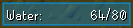
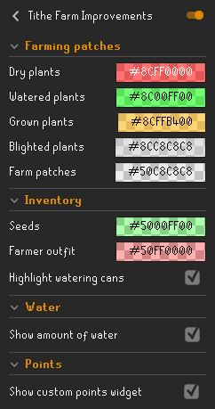

# Tithe Farm Improvements
Plugin for RuneLite to improve overall experience for Tithe farm.

## Plants progress
* Show progress of dry plants with game-tick precision
* Show progress of watered plants with game-tick precision
* Show progress of grown plants with game-tick precision
* Show progress of blighted plants with game-tick precision
* Highlight hovered farm patch

 

## Inventory highlights
* Highlight seeds
* Highlight watering cans

 

## Water panel
* Show amount of water left in watering cans
* Show total amount of water that watering cans can hold

 

## Settings

 

## Ground markers
Ground markers to do 25 plants per run can be found from [here](./groundmarkers.txt). 
