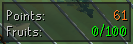
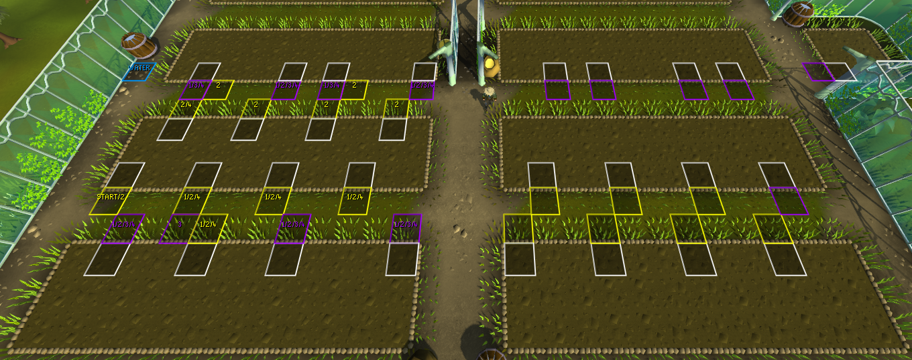

# Tithe Farm Improvements
Plugin for RuneLite to improve overall experience for Tithe farm.

## Plants progress
* Shows progress of dry plants with game-tick precision
* Shows progress of watered plants with game-tick precision
* Shows progress of grown plants with game-tick precision
* Shows progress of blighted plants with game-tick precision
* Highlights farm patch on mouse over

 

## Inventory highlights
* Highlights seeds
* Highlights watering cans

 

## Water widget
* Shows amount of water left in watering cans
* Shows total amount of water that watering cans can hold

 

## Points widget
* Shows total points
* Show how many points will be added this run
* Shows how many fruits have you harvested
* Number of harvested fruits color changes based on how good/bad you are doing

 

## Settings

 

## Ground markers
Ground markers to do 25 plants per run can be found from [here](./groundmarkers.txt). 
